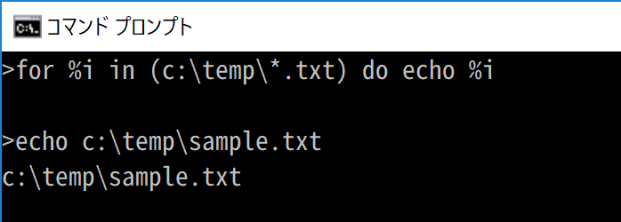
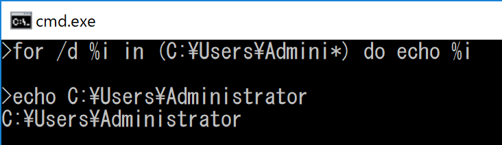

# 🔰cmd.exeをさわってみる

いまとなってはPowershellが便利なご時勢ですが。cmd.exeについて。

cmd.exeはふれあうその都度その都度で、同じことを調べてるような気がしてきたので基本を資料にまとめてみる。

## 🔰そもそもcmd.exeって？

**cmd.exe**はWindowsOS以前のDOS-OSの時代から存在する**COMMAND.COM**を拡張させて出来たWindows専用のコマンドラインインタプリタ。

WindowsXPとかでは互換のために**cmd.exe**と**COMMAND.COM**が共存しているような時代もあったようですが。

windows10な現在は**cmd.exe**だけがインストールされている様子。

ちなみにcmd.exeは32bit版と64bit版が存在する。

## 🔰ドキュメント

コマンドラインリファレンス

[Microsoft Docs - windows server - Command-Line Reference_1](https://docs.microsoft.com/en-us/windows-server/administration/windows-commands/command-line-reference_1#BKMK_Over)
[Microsoft Docs - windows xp - Command-line reference A-Z](https://docs.microsoft.com/en-us/previous-versions/windows/it-pro/windows-xp/bb490890(v%3dtechnet.10))

とりあえずMicrosoft DocsのWindows ServerやXPのページにコマンドのリファレンスは存在します。

が、windows10のページにコマンドのリファレンスはない気がします……

[Q:Where can i download Command-line reference for Windows 10](https://answers.microsoft.com/en-us/windows/forum/windows_10-other_settings-winpc/where-can-i-download-command-line-reference-for/e3028aa6-6bab-4b11-b7cd-221f4f1cd31d)

とか質問してる人もいたりする。

あとコマンドリファレンスのchmファイルもあったりします。

[Windows Command Reference](https://www.microsoft.com/en-us/download/details.aspx?id=2632)

Microsoft以外のサイトだと[ss64.com - cmd](https://ss64.com/nt/)がリファレンスとして見やすい気がする。

そして色々とカオスなcmd.exeの仕様について、解析して解説してくれているブログ記事。

[永遠に未完成 - cmd.exe のコマンドラインの仕様を解析してみた](http://thinca.hatenablog.com/entry/20100210/1265813598)

## 🔰cmd.exeを起動してみる

32bit版、64bit版のバイナリがそれぞれ下記のディレクトリにあります。

bit     | パス
:------ | :----------------------------
32bit版 | `C:\Windows\SysWOW64\cmd.exe`
64bit版 | `C:\WINDOWS\system32\cmd.exe`

ちなみにコンソール上で実行環境が何bit版かは環境変数**PROCESSOR_ARCHITECTURE**をみれば判別できるようです。

`SET  PROCESSOR_ARCHITECTURE`で変数の中身をできるので確認する。

下記の例ではAMD64と表示されているので64bit版のcmd.exeという事がわかる。


## 🔰コンソール画面で履歴とスクロール

コンソール上で**upキー** or **downキー**を押すと入力履歴の遷移となる。

コンソールのスクロールを行う時は**ctrl+up** or **ctrl+down**で行う。

## 🔰画面出力のクリア　cls

| syntax |
| :----- |
| `cls`  |

画面出力をクリアする場合は`cls`コマンドを実行すればよい

## 🔰行継続文字　^

cmd.exeの行継続文字は`^`

## 🔰コメント行 rem

| syntax           |
| :--------------- |
| `REM [コメント]` |

下記の例を見ると`rem`コマンドはコメント行として扱われ何も処理していない事が確認できる。


## 🔰コマンドヘルプ help

| syntax             |
| :----------------- |
| `HELP [command]`   |

`help cls`のようにhelpの後ろにコマンドを指定して実行すると、そのコマンドに対するヘルプが表示されます。

下記はechoコマンドのヘルプを表示してみた例。


## 🔰画面出力 echo

| syntax              |
| :------------------ |
| `ECHO [メッセージ]` |

コンソールにメッセージの表示を行う事ができます。
また`ECHO [ON | OFF]`でコマンドエコーのONとOFFを設定できます。
コマンドエコーについてはバッチファイルの所で少し説明します。

とりえあえずechoコマンドでhelloworld!

`echo helloworld`とコマンドを実行すると**helloworld**とコンソールに表示されます。


## 🔰promptコマンド prompt

| syntax            |
| :---------------- |
| `PROMPT [文字列]` |

`prompt`コマンドでコンソールのプロンプト部分の表示を制御できる。

`prompt`コマンドで利用できる特殊キャラ。

Character | Description
:-------- | :--------------------------------------
$A        | `&` (アンパサンド)
$B        | `|` (パイプ)
$C        | `(` (左かっこ)
$D        | 現在の日付
$E        | エスケープ コード (ASCII コードの 27)
$F        | `)` (右かっこ)
$G        | `>` (不等号 (より大))
$H        | バックスペース (直前の文字を削除します)
$L        | `<` (不等号 (より小))
$N        | 現在のドライブ
$P        | 現在のドライブとパス
$Q        | `=` (等号)
$S        | (空白)
$T        | 現在の時刻
$V        | Windows のバージョン番号
$_        | キャリッジ リターンとラインフィード
$$        | `$` (ドル記号)

`prompt $g`とコマンドを実行すると下記のようにプロンプト部分は`>`の表示となる。


ちなみに環境変数`prompt`に同様に値をセットすると同じように表示を制御する事ができる。


## 🔰カレントディレクトの移動 cd

| syntax                       |
| :--------------------------- |
| `CD [/D] [ドライブ:][パス]`  |
| `CD [..]`                    |

カレンドディレクトリを移動する場合には`cd`コマンドを利用する。カレントドライブを移動する場合は`/d`パラメータを利用する。
親ディレクトリに移動したい場合は`..`を指定する。

ちなみに`cd`コマンドのみで実行すると現在のディレクトリが表示されます。

## 🔰環境変数の定義、照会、削除　set

### 🔰環境変数一覧表示

| syntax |
| :----- |
| `set`  |

`set`コマンドを利用することにより環境変数の照会と編集を行う事ができる。

`set`に何も付けずに実行すると宣言されている環境変数の一覧が表示されます。


完全でない変数名でも前方一致する変数があればその一覧を表示してくれます。

`set system`と入力してsystemに合致する変数の一覧を表示する例。


### 🔰環境変数の設定

| syntax                        |
| :---------------------------- |
| `SET [変数名=[文字列]]`       |

変数名の後ろに`=`を付けて文字列を入力すると指定した名前と内容で環境変数が定義できます。
ちなみに`set`で定義した環境変数は宣言したプロセス中で有効です。（コマンドプロンプトのプロセスを終了したら消えてなくなります）

`set variable=helloworld`というコマンドで`variable`という変数に`helloworld`という文字列を代入しています。

その後、`set variable`コマンドでvariable変数の中身を確認してみるとhelloworldと表示されます。


`set variable = string`とかいうふうにイコールの前後に`space`を入れてしまうと、`variable(space)`というspaceを含んだ変数名を定義して`(space)string`という値を設定してしまう事になるので注意。

### 🔰環境変数の削除

| syntax          |
| :-------------- |
| `set variable=` |

上記のように`=`のあとに何も指定しなかった場合。環境変数variableは削除されます。


### 🔰コンソールからの入力と計算

| syntax                                 |
| :------------------------------------- |
| `SET /P 変数=[プロンプト文字列]`       |
| `SET /A 式`                            |

`set`コマンドにパラメータにpを付けて実行するとプロンプトに入力された結果を環境変数に代入してくれる。

`set /p variable=pleaseInput:`


`set`コマンドにパラメータにaを付けて実行すると、数値式を評価でき環境変数に計算結果を代入してくれる。

`set /a variable=(10+20+30)*5`


## 🔰%環境変数%で変数の内容にアクセス

| syntax       |
| :----------- |
| `%variable%` |

いままでsetで環境変数の内容を確認していましたが。

`%環境変数%`とすると環境変数の内容を展開する事ができます。

ですので、`echo %環境変数%`というように環境変数を展開してechoで表示すれば環境変数の内容がコンソールに表示されます。

```cmd
set variable=helloworld
echo %variable%
```


### 🔰環境変数を展開して出力する際に範囲を指定

| syntax                                 |
| :------------------------------------- |
| `%variable:~shiftLength,outputLength%` |

上記のように`%環境変数:~シフトする文字数,出力する文字数%`というふうに記述できる。

下記の例だとシフトは0で5文字を出力なのでhelloworldの中でhelloの部分が表示されています。

```cmd
set variable=helloworld
echo %variable:~0,5%
```


`echo %variable:~5,5%`という感じにするとworldだけ表示されます。


### 🔰環境変数を展開して出力を置換

環境変数はパーセントで括る事によりアクセスする事ができるようになりますが、下記のような記載で編集する事ができます。

| syntax                        |
| :---------------------------- |
| `%variable:StrToFind=NewStr%` |

上記のように`%環境変数:置換対象=置換文字列%`というふうに記述できる。

```cmd
set variable=helloworld
echo %variable:hello=こんにちは%
```

実際に実行すると下記のように表示される。


## 🔰特殊な環境変数

`set`コマンドのヘルプに記載がありますが、`set`コマンドではアクセスできない特殊な環境変数が存在します。

set コマンドではアクセスできず`%変数名%`の形でしかアクセスできない

Name              | description
:---------------- | :------------------------------------------------------------------------------------------------------------------
`%CD%`            | 現在のカレントディレクトリを展開
`%TIME%`          | 現在の時刻を展開
`%DATE%`          | 現在の日付を展開
`%RANDOM%`        | 0 から 32767 の間の任意の 10 進数に展開
`%ERRORLEVEL%`    | 最後に実行したコマンドのエラーレベルを展開
`%CMDEXTVERSION%` | cmd.exeのコマンド拡張機能の状態を展開。コマンド拡張機能はデフォルトで有効。これで処理を分けるケースが思いつかない……
`%CMDCMDLINE%`    | 現在のcmd.exeが開始されたときに使用されたコマンドラインの内容を展開

## 🔰if文

コマンドプロンプトのif文は文字列の比較やエラーレベルやファイルの存在チェックを行う事ができます。

| syntax                                                        |
| :------------------------------------------------------------ |
| `IF [NOT] ERRORLEVEL 番号 コマンド`                           |
| `IF [NOT] 文字列1==文字列2 コマンド`                          |
| `IF [NOT] EXIST ファイル名 コマンド`                          |

文字列の比較を行う場合は下記のように記述すればOKです。

上の方は**hoge**と**hoge**を比較して、一致するなら**true**。一致しないなら**false**と表示する。（一致するので**ture**）

下の方は**hoge**と**hogehoge**を比較して、一致するなら**true**。一致しないなら**false**と表示する。（一致しないので**false**）


## 🔰ファイルの中身を表示する typeコマンド

| syntax                              |
| :---------------------------------- |
| `TYPE  [ドライブ:][パス]ファイル名` |

`c:\temp\sample.txt`というファイルにhelloworldという一文を記述した。このテキストファイルをtypeコマンドで表示してみる。


## 🔰色々な事ができるforコマンド for

forコマンドはcmdをさわっていて、入門者が挫けそうな気がするコマンド。

forコマンドで一番戸惑うと個人的に思う所は、

- 機能が分かれるパラメータ(/r /d /l /f)が何種類かある
- `(セット)`にファイル、ディレクトリ、テキスト文字列、値の範囲と色々な値が入る
- `オプション`も色々ある

パラメータを組み合わせることにより、様々な事が出来ますが。その分、説明よんでもとっつきづらい気がします。

なんとなくfor文ってループみたいな？　そんなイメージでさわると嵌まる気がします。

for文一つによくもこんなに機能をつめこみやがったなって感じ。

### 🔰for

一番単純なfor文。

| syntax                                                                  |
| :---------------------------------------------------------------------- |
| `FOR %変数 IN (セット) DO コマンド [コマンドパラメーター]`              |

`(セット)`に文字列を指定した場合はspaceで区切って`%変数`に渡して、ひとつずつ処理する。

`for %i in (hello world) do echo %i`


`(セット)`にワイルドカードを利用して`ファイルグループ`を指定した場合は、該当するファイル名が存在するか検索してヒットする物があると変数に渡される。
`ファイル名`のみの指定の場合はカレントディレクトリが検索される。

下記では`c:\temp\*.txt`というファイルグループで検索して、合致するものが`%変数`に引き渡されて、echoで表示している。

`for %i in (c:\temp\*.txt) do echo %i`



### 🔰for /d

| syntax                                                                   |
| :----------------------------------------------------------------------- |
| `FOR /D %変数 IN (セット) DO コマンド [コマンド パラメーター]`           |

`(セット)`に`ファイルグループ`を指定した時に、ファイルグループに合致するディレクトリのみ変数に渡される。



### 🔰for /r

| syntax                                                                                      |
| :------------------------------------------------------------------------------------------ |
| `FOR /R [[ドライブ:]パス] %変数 IN (セット) DO コマンド [コマンド パラメーター]`            |

指定したパスからサブディレクトリを含めて検索し、変数に渡される。

下記のようなディレクトリ構造があった時に

```tree
C:\TEMP
├─batchArgs.bat
├─batchFile.bat
├─sample.txt
│
└─forR
    └─forRsample.txt
```

`for /r c:\temp %i in (*.txt) do echo %i`を実行すると下記のようになる。


### 🔰for /l

| syntax                                                                                      |
| :------------------------------------------------------------------------------------------ |
| `FOR /L %変数 IN (開始,ステップ,終了) DO コマンド [コマンド パラメーター]`                  |

`開始`から`終了`まで`ステップ`で指定した値ずつ増減を繰り返す。


### 🔰for /f

| syntax                                                                                                  |
| :------------------------------------------------------------------------------------------------------ |
| `FOR /F ["オプション"] %変数 IN (ファイル セット) DO コマンド [コマンド パラメーター]`                  |
| `FOR /F ["オプション"] %変数 IN ("文字列") DO コマンド [コマンド パラメーター]`                         |
| `FOR /F ["オプション"] %変数 IN ('コマンド') DO コマンド [コマンド パラメーター]`                       |

パラメータのfが一番いろんな事ができて一番取っつきづらい。

- `... in (foobar) ...`と指定すると、`ファイル`とみなして指定した`指定されたファイルの中身`を`オプション`でパースして変数に渡す。
- `... in ("foobar") ...`と指定すると、`テキストリテラル`とみなして指定した`テキストリテラル`を`オプション`でパースして変数に渡す。
- `... in ('foobar') ...`と指定すると、`コマンド名`とみなして`コマンドを実行してその返り値`を`オプション`でパースして変数に渡す。

 オプションには下記が指定できる。

| オプション       | description                                                                                                                                                                                                                                                                                                                            |
| :--------------- | :------------------------------------------------------------------------------------------------------------------------------------------------------------------------------------------------------------------------------------------------------------------------------------------------------------------------------------- |
| `eol=c`          | eolを指定して、行頭がeolならばその行をスキップする。(デフォルトの指定はeol=;)                                                                                                                                                                                                                                                          |
| `skip=n`         | ファイルの先頭でスキップする行数を指定します。                                                                                                                                                                                                                                                                                         |
| `delims=xxx`     | 区切り文字のセットを指定します。デフォルトの指定はspaceで区切り文字(delims= )                                                                                                                                                                                                                                                          |
| `tokens=x,y,m-n` | 各繰り返しに対して、各行から for 本体に渡すトークンを指定します。これにより、追加の変数名が割り当てられます。m-n の形式は範囲で、m 番目から n 番目のトークンを指定します。tokens= 文字列の最後の文字がアスタリスクである場合は、追加の変数が割り当てられ、最後のトークンが解析された後、行に含まれている残りのテキストを受け取ります。 |
| `usebackq`       | 次の新しい表示形式を指定します。逆引用符で囲まれた文字列がコマンドとして実行され、一重引用符で囲まれた文字列がリテラル文字列コマンドになり、ファイル セットのファイル名を二重引用符で囲めるようになります。                                                                                                                            |

`for /f ...　in (ファイルセット)`コマンドを呼び出して利用してみる。**forF.txt**という下記内容を記載したテキストファイルを読み出してみる。


`オプション`は`eol`に指定した文字は`H`で区切り文字はなし(`delims=`)を指定。
このため行頭が`H`ではじまる`Hello World cmd.exe`はスキップされ、spaceで区切られないようにパースされる事が確認できる。


`for /f ...　in (文字列)`コマンドを呼び出して利用してみる。今回対象とする文字列は`dummy,hello,world,cmd.exe,dummy`。
**オプション**は**tokens**が**2から4**を指定して、**delims=,**でカンマを区切り文字に指定。
このため区切り文字が**,(カンマ)**で区切られ2,3,4番目に指定されているhello world cmd.exeの３つのリテラルがパースされている事が確認できる。


`for /f ...　in (コマンド)`コマンドを呼び出して利用してみる。今回対象とする**コマンド**は`dir /b c:\temp\`でファイル名の列挙。
コマンドの実行結果を変数に渡してファイル名の一覧が表示される事が確認できる。


## 🔰バッチファイル bat

コマンドを記述したテキストファイルを拡張子**bat**もしくは**cmd**で保存するとバッチファイルを作成する事ができます。
バッチファイルはテキストに記述したコマンドを順次実行していってくれる。

基本的にはコマンドラインと同様にバッチファイルに記述すれば動くのだが、動かないケースもあったりする。後述の**batファイル中で%記号が消える問題**を参照

下記のように記述してbatchFile.batというファイルを作成して実行する。


上記は`echo`コマンドでechoのモードをONにして**hello**と**world**を出力するサンプル。

作成したバッチファイルを選択して**右クリックから実行**でバッチファイルの処理を実行できますが、表示がすぐに閉じてしまうので下記のように実行してみる。

コマンドラインからバッチファイルを指定してenter。

**hello** と **world**が表示されました。


helloとworldが表示される前の段に、実行したコマンドが表示されていますがこれはエコーモードがONになっているからです。

バッチファイルの先頭でエコーモードをOFFに設定するとこの表示はされなくなります。

下記の例だと先頭に`@`を付けていますが、`@`を付けると該当業のエコーモードがOFFになります。この`@`をつける事により`echo off`コマンド自体をエコーモードoffで実行します。


## 🔰バッチファイルで引数にアクセスする

バッチファイルに引数を渡して実行する場合。

バッチファイル側では渡された順番通りに%1,%2,%3,%4,%5,%6,%7,%8,%9でそれぞれアクセスする事ができる。
また%0にはバッチファイル自身のパスが代入されます。

例えば、**batchArgs.bat**というファイルを下記内容で作成する。


作成した**batchArgs.bat**に引数`hello world windows cmdBatch`という引数を渡して実行してみる。


引数にアクセスする際に下記のような拡張構文が存在しています。

`%1`の引数にアクセスする時の拡張構文

| 構文      | description                                                                                                                                                                                                                             |
| :-------- | :-------------------------------------------------------------------------------------------------------------------------------------------------------------------------------------------------------------------------------------- |
| %~1       | すべての引用句 (") を削除して、%1 を展開します。                                                                                                                                                                                      |
| %~f1      | %1 を完全修飾パス名に展開します。                                                                                                                                                                                                     |
| %~d1      | %1 をドライブ文字だけに展開します。                                                                                                                                                                                                   |
| %~p1      | %1 をパスだけに展開します。                                                                                                                                                                                                           |
| %~n1      | %1 をファイル名だけに展開します。                                                                                                                                                                                                     |
| %~x1      | %1 をファイル拡張子だけに展開します。                                                                                                                                                                                                 |
| %~s1      | 展開されたパスは、短い名前だけを含みます。                                                                                                                                                                                            |
| %~a1      | %1 をファイル属性に展開します。                                                                                                                                                                                                       |
| %~t1      | %1 をファイルの日付/時刻に展開します。                                                                                                                                                                                                |
| %~z1      | %1 をファイルのサイズに展開します。                                                                                                                                                                                                   |
| %~$PATH:1 | PATH 環境変数に指定されているディレクトリを検索し、最初に見つかった完全修飾名に %1 を展開します。環境変数名が定義されていない場合、または検索してもファイルが見つからなかった場合は、この修飾子を指定すると空の文字列に展開されます。 |

## 🔰batファイル中で%記号が消える問題

forコマンド等をbatファイル中で利用してみると気づきますが、コマンドラインで実行すると動くのにbatファイルに同様に記述しても動かないコマンドが存在します。

たとえば`for %i in (hello world) do echo %i`とかコマンドライン上では動きますが、batファイルに同じ事を記述しても動きません。

batファイル上でコマンドライン上と同様に動かすには`for %%i in (hello world) do echo %%i`と記述する必要があります。

ここらへんの説明は検索すると、[KB75634 - Percent Signs Stripped from Batch File Text](https://support.microsoft.com/en-us/kb/75634)にあるとか書かれてますが、すでにMSのサイトはリンク切れ……残念！　でしたがKnowledgeBase Archiveに該当のアーカイブがありました。

[Q75634: Percent Signs Stripped from Batch File Text](https://jeffpar.github.io/kbarchive/kb/075/Q75634/)

- コマンドにパーセント記号が一つだと、**null**文字として扱われる。
- コマンドにパーセント記号が２つありパーセント記号の間に文字がある場合、環境変数として展開する。
- コマンドにパーセント記号が2つ続けてある場合、片方の%はエスケープしてパーセント一つとして扱われる。

まとめると

- バッチファイル中に`for %i in (hello world) do echo %i`と書いた場合。
- `%i in (hello world) do echo %`の部分が変数として解釈される。
- `%i in (hello world) do echo %` なんて変数を定義してないのでこれはNULLとなる。
- `for i`というコマンドが完成！
- エラー

という流れになります。バッチファイル中で上記のコマンドを実行したいならば`%%`とエスケープして。

`for %%i in (hello world) do echo %%i`と記述すれば動いてくれます。

## 🔰遅延環境変数

`set`コマンドのヘルプに説明が少し書かれている遅延環境変数ですが、これも**cmd.exe**の中では理解しづらい。

遅延環境変数を理解する前提として、そもそも**cmd.exe**での環境変数の展開されるタイミングを理解する必要があります。

下記は`set`コマンドのヘルプにある例ですが。(なぜか日本語ヘルプだと余計な`;`が入ってたりするので少し手を入れてます)

if文がネストしていて環境変数**VAR**に**before**や**after**をセットして、それをif文で評価しています。

```cmd
set VAR=before
if "%VAR%" == "before" (
    set VAR=after
    if "%VAR%" == "after" ( @echo If you see this, it worked )
)
```

ぱっとみた感じだと最初のif文の時は環境変数**VAR**はbeforeをセットされているので、if文(**before**かどうか)は真。

このif文の処理ブロックで**VAR**に**after**がセットされて、次のif文は(**after**かどうか)は真。

処理ブロック中の`@echo If you see this, it worked`が実行されて、**If you see this, it worked**とコンソールに表示される。

というような動作になるように思うのですが、実際に実行するとコンソールには何も表示されません。

これは、**cmd.exe**では環境変数が評価されるのは**コマンドが読み込まれる時**に評価される事に起因しており。

実際はif文の処理ブロックを読み込む際に環境変数**VAR**は既に**before**と展開されています。

その後`set VAR=after`としても既に**before**と評価されているので後の祭り。

このような現象を打開するためには遅延環境変数を利用します。

遅延環境変数を利用するためには、まず遅延環境変数を有効にする必要があります。

遅延環境変数を有効にするには下記の何れかを行います。

- cmdを起動時に`cmd /v:on`とパラメータ`/v:on`をつけてcmdを起動する。
- バッチファイル中で遅延環境変数を有効にする場合は`setlocal enabledelayedexpansion`とコマンドを実行する。

下記の例だとコンソール上で動かしている為`cmd /v:on`で遅延環境変数を有効にしています。
(バッチファイルの場合は`setlocal enabledelayedexpansion`を使用して下さい)

遅延環境変数を有効にした後に、`%`ではなく`!`で変数名を括って環境変数を展開すれば遅延環境変数を利用できます。

遅延環境変数では変数が展開されるタイミングがテキストを読み込んだ時ではなく式が評価されるタイミングまでまってくれるようになります。

```cmd
cmd /v:on

set VAR=before
if "%VAR%" == "before" (
    set VAR=after
    if "!VAR!" == "after" ( @echo If you see this, it worked )
)
```


上記コマンドを実行すると変数が評価されるタイミングがコマンドが読み込まれた時ではなく。

`if "!VAR!" == "after" ( @echo If you see this, it worked )`が評価されるタイミングで`!VAR!`が評価されて`@echo If you see this, it worked`が実行される事がわかります。

## 🔰リダイレクト

今までコマンドを実行してコンソール（標準入力・標準出力・標準エラー出力）に結果を表示させていましたが。

コマンドプロンプトは実はコマンドの実行結果を

正常終了の場合は標準出力。

エラーの場合は標準エラー出力。

とそれぞれ別の場所に出力して最終的にコンソールに表示されるような仕組みになっていたりします。

リダイレクトを利用することにより、それぞれの出力をファイルに出力したりコマンドに引き渡したりすることができます。

syntax                 | description
:--------------------- | :------------------------------------------------------------------------
`command < filename`   | ファイルから標準入力へ読み込む
`command > filename`   | 標準出力からファイルへ出力する（上書き）
`command >> filename`  | 標準出力からファイルへ出力する（追記）
`commandA | commandB`  | commandAの結果をcommandBに引き渡す
`commandA 2> filename` | 標準エラー出力をファイルに出力する
`command >&h`          | コマンドの結果をリダイレクトする先を指定。`h`はそれぞれ0:標準入力,1:標準出力,2:標準エラー

ここではざっくりとサンプルを提示。

### 🔰`command < filename`のケース

下記のように記述すると中身を標準入力に引き渡し、clipコマンドでクリップボードにリダイレクトします。

`clip < c:\temp\sample.txt`

### 🔰`command > filename`のケース

echoコマンドは標準出力に文字列を引き渡すのでそれをリダイレクト`>`でファイルに上書きします。

`echo helloworld > c:\temp\helloworld.txt`


### 🔰`command >> filename`のケース

echoコマンドは標準出力に文字列を引き渡すのでそれをリダイレクト`>>`でファイルに追記します。

`echo helloworld >> c:\temp\helloworld.txt`


### 🔰`commandA | commandB`のケース

`type`コマンドで**pipe.txt**を読み込み、パイプを利用して`find`コマンドへ引き渡す。


### 🔰`commandA 2> filename`と`command >&h`のケース

`dir`コマンドでは存在しないパスを指定すると、標準出力に**ドライブ....**、標準エラー出力に**ファイルが見つかりません**と結果を返します。

この時に`>`を利用してテキストファイルに標準出力のリダイレクトを行う。コンソールには標準エラー出力**ファイルが見つかりません**のみ表示されます。

`dir c:\hogehoge > c:\temp\dir.txt`


下記コマンドでは標準エラー出力の文字列(**ファイルが見つかりません**)を`2>&1`で標準エラー`2`を標準出力にリダイレクト`>&1`する事により、標準出力と標準エラー出力を一つのファイルに出力させてみます。

`dir c:\hogehoge > c:\temp\dir.txt 2>&1`

typeコマンドで出力したテキストファイルを表示してみると、標準出力の**ドライブ...**と標準エラー出力の**ファイルが見つかりません**の文字列がテキストファイルに出力されている事がわかります。


ちなみに下記のよう**> filanme**と**2>filename**を両方指定することによって標準出力と標準エラーをそれぞれ別ファイルに書き込む事もできます。

`dir c:\hogehoge > c:\temp\dir.txt 2>c:\temp\error.txt`


## 🔰start

`start`コマンドでプログラムやコマンドを実行する事ができます。

下記コマンドでは**notepad.exe**を起動します。

`start notepad.exe`

`/wait`オプションを指定すると、起動したアプリケーションorコマンドが終了するまで待つようになります。

## 🔰総評

やっぱcmdはさわっててつらみがあるきがする。